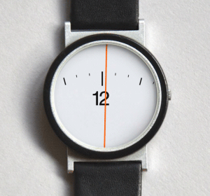
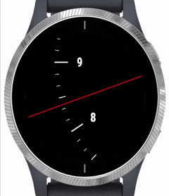

# Spotlight watch face for Garmin devices

This is a clone from the Android watch face [Spotlight](https://play.google.com/store/apps/details?id=com.maize.spotlight) by Maize wich is an implementation of this original idea by [Konstantin Pulyarkin](http://hop-picker.tumblr.com/post/51065757240):

There are multiple implementations for this watch face for Android and Garmin but the Garmin version ([Zoomface](https://apps.garmin.com/en-US/apps/15d521ab-e562-4fde-a708-852102025a75)) that i found isn't compatible with the Garmin Venu.

I really wanted to have this watch face for my Venu so i tried to create it myself. At a certain moment i got stuck and then [docwilco](https://github.com/docwilco) basically took over :)

This is the result:

Get it from the [Garmin Connect IQ Store](https://apps.garmin.com/en-US/apps/b900b0b7-930c-4889-8878-bfae92a72b82)

Use the [color configurator](https://nldroid.github.io/spotlight/) to experiment with different colors. The tool will give you the color codes that you can enter in the configuration app.
